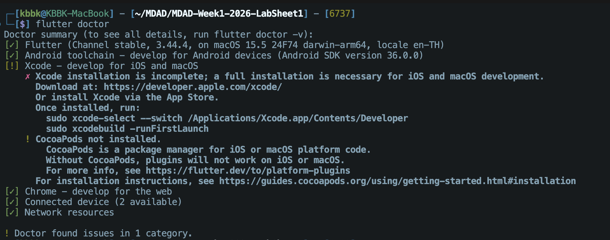
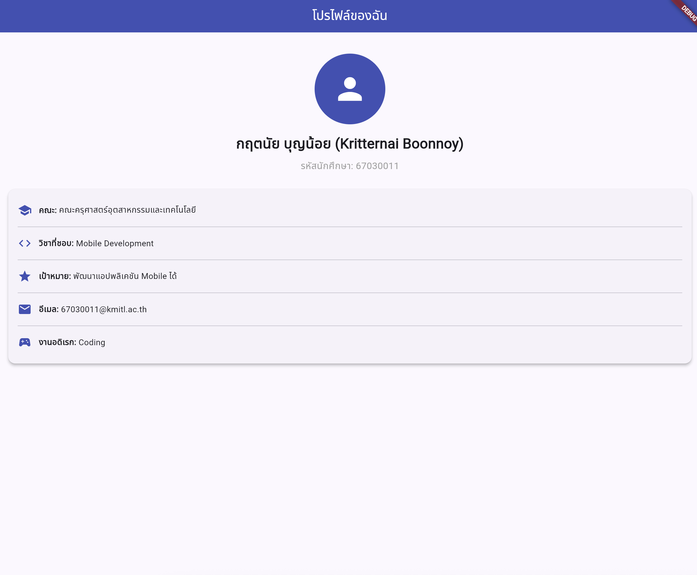

# 📱 ใบงานการทดลองที่ 1
## วิชา: การพัฒนาซอฟต์แวร์สำหรับอุปกรณ์เคลื่อนที่ (Mobile Software Development)
## หัวข้อ: ปฐมนิเทศ & แนะนำ Mobile Development — Flutter, Dart & Google AI Studio

---

| รายละเอียด | ข้อมูล |
|---|---|
| **สัปดาห์ที่** | 1 |
| **ชั่วโมง** | 3.5 ชั่วโมง (ทฤษฎี + ปฏิบัติ) |
| **CLO ที่เกี่ยวข้อง** | CLO1, CLO4 |
| **เครื่องมือหลัก** | VS Code, Flutter SDK, Dart, Google AI Studio |
| **เครื่องมือเสริม** | Android SDK Command-line Tools, Chrome Browser, ADB |

---

## 📋 ส่วนที่ 3: แบบบันทึกผลการทดลอง (Lab Report)

### 3.1 ผลการติดตั้ง Flutter

```
Doctor summary (to see all details, run flutter doctor -v):
[✓] Flutter (Channel stable, 3.44.4, on macOS 15.5 24F74 darwin-arm64, locale en-TH)
[✓] Android toolchain - develop for Android devices (Android SDK version 36.0.0)
[!] Xcode - develop for iOS and macOS
    ✗ Xcode installation is incomplete; a full installation is necessary for iOS and macOS development.
[✓] Chrome - develop for the web
[✓] Connected device (2 available)
[✓] Network resources
```

Flutter Version: 3.44.4
Dart Version: 3.12.2
Android SDK Version: 36.0.0




### 3.2 Screenshot ของ Flutter App




**Widget Tree ที่วาด:**

```
MaterialApp
└── MainNavigationPage (StatefulWidget)
    └── Scaffold
        ├── body: _pages[_currentIndex]
        │   └── ProfilePage (StatelessWidget)
        │       └── Scaffold
        │           ├── AppBar
        │           │   └── Text ("โปรไฟล์ของฉัน")
        │           └── Padding (padding: 16.0)
        │               └── Column (crossAxisAlignment: center)
        │                   ├── SizedBox (height: 20)
        │                   ├── CircleAvatar (radius: 60)
        │                   │   └── Icon (Icons.person)
        │                   ├── SizedBox (height: 16)
        │                   ├── Text ("กฤตนัย บุญน้อย (Kritternai Boonnoy)")
        │                   ├── SizedBox (height: 8)
        │                   ├── Text ("รหัสนักศึกษา: 67030011")
        │                   ├── SizedBox (height: 24)
        │                   └── Card (elevation: 4)
        │                       └── Padding (padding: 16.0)
        │                           └── Column
        │                               ├── _buildInfoRow (คณะ)
        │                               │   └── Row
        │                               │       ├── Icon (Icons.school)
        │                               │       ├── SizedBox (width: 12)
        │                               │       ├── Text ("คณะ: ")
        │                               │       └── Expanded
        │                               │           └── Text ("คณะครุศาสตร์อุตสาหกรรมและเทคโนโลยี")
        │                               ├── Divider
        │                               ├── _buildInfoRow (วิชาที่ชอบ)
        │                               ├── Divider
        │                               ├── _buildInfoRow (เป้าหมาย)
        │                               ├── Divider
        │                               ├── _buildInfoRow (อีเมล)
        │                               ├── Divider
        │                               └── _buildInfoRow (งานอดิเรก)
        └── bottomNavigationBar: BottomNavigationBar
            ├── BottomNavigationBarItem (โปรไฟล์)
            └── BottomNavigationBarItem (AI Chat Demo)
```


### 3.3 การเปรียบเทียบ Hot Reload vs Hot Restart

| รายการ | Hot Reload (r) | Hot Restart (R) |
|---|---|---|
| ความเร็ว | เร็วมาก (น้อยกว่า 1 วินาที) | ปานกลาง (ประมาณ 2-3 วินาที) |
| State ถูก Reset? | ไม่ถูก Reset (คงสถานะของแอปไว้) | ถูก Reset (เริ่มต้นการทำงานของแอปใหม่ทั้งหมด) |
| ใช้เมื่อไหร่ | ตกแต่ง UI, ปรับแก้คำ/สไตล์, พัฒนาหน้าจอแอปทั่วไป | แก้ไขโครงสร้าง State, โค้ดเริ่มต้น (init/main), หรือการทำงานระดับ Logic หลัก |


### 3.4 ผลการทดลอง Prompt Engineering

**Prompt แบบ Simple:**
```
ช่วยเขียน Flutter Widget สำหรับแสดงสภาพอากาศ (Weather Card) ด้วย StatelessWidget ให้หน่อย
```

**Prompt แบบ Detailed:**
```
ช่วยสร้าง Flutter Widget ชื่อ WeatherCard ด้วย StatelessWidget โดยรับค่าตัวแปรดังนี้: city, temperature, condition, และ humidity
มีไอคอนแสดงตามสภาพอากาศ (sunny -> wb_sunny, cloudy -> cloud, rainy -> water_drop)
และให้ตกแต่ง UI แบบ Premium:
- ใช้ Card ที่มีเงาและขอบมนแบบ Modern (borderRadius 25)
- ใส่ Background สี Gradient (น้ำเงิน 400 ถึง น้ำเงิน 700)
- ออกแบบตัวอักษรอุณหภูมิให้มีขนาดใหญ่ชัดเจน
- แสดงผล Humidity ภายในกรอบ Container โปร่งแสงพร้อมไอคอนหยดน้ำที่สวยงาม
```

**ความแตกต่างของผลลัพธ์**
```
1. ด้านดีไซน์และความสวยงาม
   - ผลลัพธ์จาก Simple Prompt หน้าตาจะดูเรียบๆ ธรรมดามาก ออกแนว Material 3 เดิมๆ ที่อิงสีตาม ThemeData ทั่วไป ไม่ได้ตกแต่งอะไรเป็นพิเศษ
   - ผลลัพธ์จาก Detailed Prompt หน้าตาการ์ดดูสวยและพรีเมียมขึ้นมาทันทีเลย มีทั้งพื้นหลังสี Gradient ไล่เฉด มีเงาดูมีมิติ และจัดกล่องแสดงความชื้นแบบโปร่งแสง ทำให้แอปดูน่าใช้งานขึ้นมาก

2. ความครบถ้วนตรงกับระบบที่ต้องการ
   - ผลลัพธ์จาก Simple Prompt AI เขียนโครงสร้างมาให้แบบกลางๆ ไม่ได้กำหนดชื่อตัวแปรหรือรายละเอียดเฉพาะเจาะจง เวลาเอามาใช้จริงต้องมานั่งแก้โค้ดเพิ่มเองอีกเยอะ
   - ผลลัพธ์จาก Detailed Prompt AI เขียนตัวแปรมารองรับครบเลย ทั้ง city, condition และยังมี logic เปลี่ยนไอคอนตามสภาพอากาศให้เรียบร้อย เอาโค้ดไปประกอบใช้ในโปรเจกต์ได้เลย แทบไม่ต้องปรับแก้เพิ่มแล้ว
```


### 3.5 Screenshot ของ AI Chat App


---

## 📝 ส่วนที่ 4: คำถามท้ายบท (Review Questions)

**1.** Flutter แตกต่างจาก React Native อย่างไรในแง่ของ Rendering Engine?

```
คำตอบ
Flutter จะใช้ Rendering Engine ของตัวเองชื่อว่า Impeller (แต่ก่อนใช้ Skia) ซึ่งมันจะทำการวาด UI ขึ้นมาเองทุก pixel บนหน้าจอเลย ไม่ได้ไปเรียกใช้ Native Widget ของเครื่อง ทำให้หน้าตาแอปออกมาเหมือนกันเป๊ะในทุกระบบปฏิบัติการเลย แต่ข้อเสียคือขนาดไฟล์แอปอาจจะใหญ่กว่านิดหน่อย 
ส่วน React Native จะใช้ตัว Bridge เพื่อคอยคุยและสั่งให้ระบบปฏิบัติการช่วยดึง Native Components ของเครื่องนั้นๆ มาแสดงผลอีกที
```

**2.** อธิบายความแตกต่างระหว่าง `StatelessWidget` และ `StatefulWidget` พร้อมยกตัวอย่างการใช้งานที่เหมาะสมของแต่ละประเภท

```
คำตอบ
StatelessWidget จะเป็น Widget ที่สร้างแล้วสร้างเลย ไม่สามารถเปลี่ยนหน้าตาหรือค่าข้อมูลในตัวเองได้ตอนที่แอปกำลังทำงานอยู่ เหมาะกับ UI ที่แสดงผลนิ่งๆ ไม่มีการเปลี่ยนแปลง เช่น พวกรูป Logo ไอคอน ข้อความหัวข้อ หรือปุ่มทั่วไป
ส่วน StatefulWidget จะเป็น Widget ที่สามารถเปลี่ยนแปลงหน้าตาและข้อมูลตามสถานะ (State) ภายในได้ตลอดเวลา เหมาะกับ UI ที่ต้องมีการโต้ตอบและอัปเดตหน้าจอตามผู้ใช้ เช่น ปุ่มกด Like หน้าต่างแชทที่มีข้อความเด้งเพิ่มเข้ามา ฟอร์มกรอกข้อมูล หรือตัวนับเลข Counter
```

**3.** เหตุใดจึงห้าม Commit API Key ลง Git Repository? และมีวิธีจัดการ API Key อย่างปลอดภัยอย่างไรบ้าง?

```
คำตอบ
ที่ไม่ควร Commit API Key ลง Git เด็ดขาด เพราะถ้า Repository ของเราเป็นแบบ Public (หรือถ้ามีคนอื่นเข้าถึงได้) คนภายนอกอาจจะแอบเอา Key ของเราไปสวมรอยใช้งานได้ ซึ่งอาจทำให้เราโดนคิดค่าบริการมหาศาลหรือระบบโดนโจมตีได้เลย

วิธีจัดการ API Key ให้ปลอดภัย
1. เก็บค่าไว้ในไฟล์ .env แล้วเอาชื่อไฟล์ไปใส่ใน .gitignore เพื่อไม่ให้ Git ดึงขึ้นไปบนเซิร์ฟเวอร์
2. ใช้ Environment Variables หรือพวก Secret Management ของระบบคลาวด์ เช่น GitHub Secrets หรือ Firebase Config
3. เวลาเขียนโค้ดตัวอย่างในโปรเจกต์ ให้ใส่เป็นข้อความสมมติ (Placeholder) ไว้แทน แล้วค่อยให้ผู้ใช้เอา Key จริงมาใส่เองตอนรัน
```

**4.** Hot Reload ทำงานอย่างไร และมีข้อจำกัดอะไรบ้าง?

```
คำตอบ
Hot Reload ทำงานโดยการส่งโค้ดไฟล์ล่าสุดที่เราเพิ่งแก้ไข (Inject) เข้าไปใน Dart VM ที่กำลังรันแอปอยู่ทันที ทำให้หน้าจออัปเดตดีไซน์ใหม่ได้ในเวลาไม่ถึงวินาที โดยที่ตัวแปรหรือสถานะ (State) ต่างๆ ของแอปยังอยู่เหมือนเดิม ไม่ถูกรีเซ็ตใหม่

ข้อจำกัดของ Hot Reload
1. ถ้าเราไปแก้ไขฟังก์ชัน main() หรือพวกตัวแปร static จะใช้ Hot Reload ไม่เห็นผล ต้องใช้ Hot Restart แทน
2. ถ้าในโค้ดมี syntax error หรือพิมพ์ผิดอยู่ มันจะไม่ยอม Reload ให้
3. ไม่รองรับการปรับเปลี่ยนโครงสร้างบางอย่าง เช่น การเปลี่ยนประเภทตัวแปร (Data type) หรือการเพิ่ม/ลดค่าใน Enum
4. เนื่องจากมันไม่ได้รีเซ็ต State บางครั้งถ้าเราเปลี่ยนค่าเริ่มต้นของ State ไป หน้าจออาจจะไม่ยอมอัปเดตตามจนกว่าจะ Hot Restart
```

**5.** จากการทดลองใช้ Gemini API ในวันนี้ คุณคิดว่าสามารถนำ AI มาช่วยพัฒนาแอปในแง่ไหนได้บ้าง? ยกตัวอย่าง Use Case 3 อย่าง

```
คำตอบ
1. ช่วยเขียนโค้ดและสร้างหน้าจอ UI (Code Generation) เราสามารถสั่งให้ AI ช่วยขึ้นโครงสร้าง Flutter Widget หรือเขียนฟังก์ชันตามที่เราต้องการได้ ช่วยประหยัดเวลาในการเขียนโค้ดซ้ำๆ ไปได้เยอะมาก
2. ช่วยหาและแก้ไขบั๊ก (Bug Fixing & Debugging) เวลาติด Error แดงๆ แล้วแปลไม่ออก เราสามารถก๊อปปี้ Error Message ไปให้ AI ช่วยวิเคราะห์สาเหตุพร้อมทั้งเสนอวิธีแก้ให้ตรงจุดได้ทันที
3. ช่วยเขียนอธิบายโค้ดและทำเอกสาร (Documentation) สำหรับโค้ดส่วนที่ซับซ้อนหรือยาวมากๆ เราสามารถให้ AI ช่วยเขียนสรุปการทำงาน เขียนคอมเมนต์ในโค้ด หรือช่วยร่างเอกสารอธิบายระบบให้กับทีมได้
```

---

## ✅ Checklist ก่อนส่ง

- [x] `flutter doctor` ไม่มี `[✗]` (มี `[!] Android Studio` ได้ — ปกติสำหรับ VS Code Workflow)
- [x] App รันได้บน Chrome หรือ Android Device/Emulator
- [x] Profile Card แสดงข้อมูลของตัวเอง
- [x] AI Chat คุยกับ Gemini ได้จริง
- [x] API Key ไม่ถูก Commit ลง Git (ตรวจสอบ `.gitignore`)
- [x] ตอบคำถามท้ายบทครบทุกข้อ
- [x] Repository structure ถูกต้องตามที่กำหนด

---

## 📚 แหล่งข้อมูลเพิ่มเติม (References)

| แหล่งข้อมูล | URL |
|---|---|
| Flutter Official Docs | https://docs.flutter.dev |
| Dart Language Tour | https://dart.dev/language |
| Flutter Widget Catalog | https://docs.flutter.dev/ui/widgets |
| Google AI Studio | https://aistudio.google.com |
| Gemini API Docs (Dart) | https://ai.google.dev/api/dart/google_generative_ai |
| pub.dev (Package Registry) | https://pub.dev |
| Material Design 3 | https://m3.material.io |
| Flutter YouTube Channel | https://youtube.com/@flutterdev |

---

*ใบงานนี้เป็นส่วนหนึ่งของวิชา Mobile Software Development | สัปดาห์ที่ 1*
*อัปเดตล่าสุด: มิถุนายน 2568*
