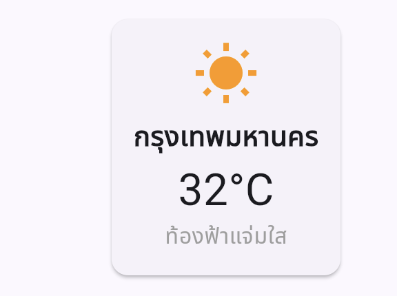
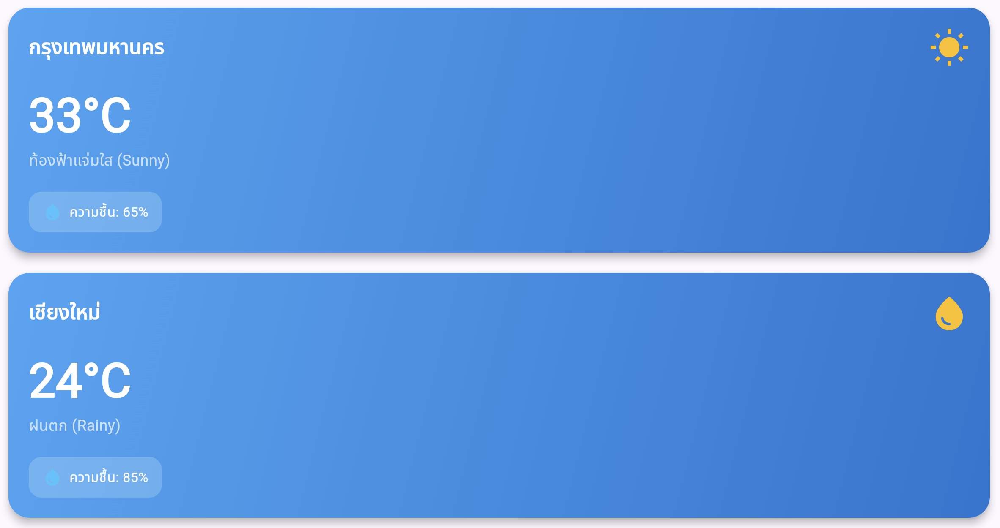

# 📱 Week 01: Flutter Intro & Gemini AI Chat (67030011)

[](https://flutter.dev)
[](https://dart.dev)
[](https://aistudio.google.com)

โปรเจกต์แอปพลิเคชัน Flutter สำหรับใบงานการทดลองที่ 1 รายวิชา **การพัฒนาซอฟต์แวร์สำหรับอุปกรณ์เคลื่อนที่ (Mobile Software Development)** พัฒนาโดยนักศึกษารหัส **67030011**

---

## 📌 เอกสารและรายงานผลการทดลอง (Lab Report)
* 📄 **[อ่านรายงานผลการทดลองฉบับเต็ม (LAB_REPORT.md)](./LAB_REPORT.md)** — รวมผลการทดลอง Prompt Engineering, โครงสร้าง Widget Tree และคำตอบคำถามท้ายบททั้ง 5 ข้อ

---

## 🚀 ฟีเจอร์หลักของแอปพลิเคชัน (Features)

### 1. Profile Card App 👤
แอปพลิเคชันแสดงบัตรแนะนำตัว (Profile Card) ที่ตกแต่งด้วยดีไซน์ Modern & Premium โดยใช้ข้อมูลจริงของนักศึกษา พร้อมปุ่มติดต่อและป้ายกำกับทักษะ (Skill Tags)

### 2. AI Chat App 🤖
แอปพลิเคชันแชทอัจฉริยะที่เชื่อมต่อกับ **Google Gemini API** (รุ่น `gemini-1.5-flash`) สามารถพูดคุย โต้ตอบ และตอบคำถามได้แบบ Real-time

---

## 📸 ตัวอย่างหน้าจอการทำงาน (Screenshots)

### แอปพลิเคชันหลัก
| 👤 Profile Card App | 🤖 AI Chat App | 🛠️ Flutter Setup & Doctor |
| :---: | :---: | :---: |
|  |  |  |

### ผลการทดลอง Prompt Engineering (ข้อ 3.4)
| 🌤️ Simple Prompt Result | 🌈 Detailed Prompt Result |
| :---: | :---: |
|  |  |

---

## 🛠️ วิธีการติดตั้งและรันโปรเจกต์ (Getting Started)

1. **โคลนโปรเจกต์:**
   ```bash
   git clone https://github.com/Kritternai/week01-flutter-intro-67030011.git
   cd week01-flutter-intro-67030011
   ```

2. **ติดตั้ง Dependencies:**
   ```bash
   flutter pub get
   ```

3. **ตั้งค่า API Key (สำหรับ AI Chat App):**
   * ตั้งค่า Google Gemini API Key ในไฟล์ `lib/config/api_config.dart` หรือในไฟล์ `.env` ตามโครงสร้างที่กำหนด:
     ```dart
     const String geminiApiKey = 'YOUR_API_KEY_HERE';
     ```

4. **รันแอปพลิเคชัน:**
   ```bash
   flutter run -d chrome   # สำหรับ Web
   # หรือรันบน Android Emulator / อุปกรณ์จริง
   flutter run
   ```

---
*พัฒนาเพื่อการศึกษาในรายวิชา Mobile Software Development (MDAD 2026)*
